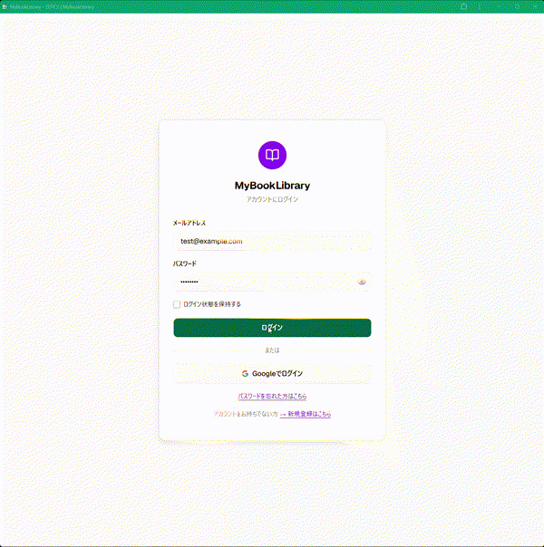
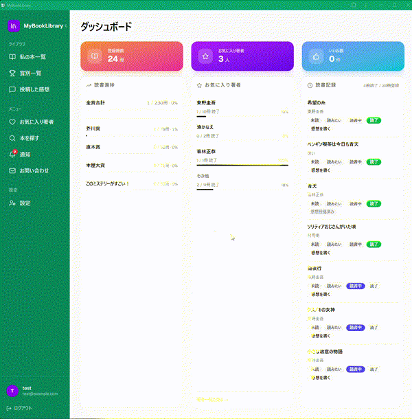

# MyBookLibrary

文学賞の受賞・ノミネート作品の読書進捗管理と、お気に入り著者の管理を行う Web アプリケーション。

## ライブデモ

🌐 [ライブデモを試す](https://d29rpr1gfxxlgj.cloudfront.net)

> **テストアカウント**
>
> | | |
> | --- | --- |
> | メール | `demo@example.com` |
> | パスワード | `Demo1234!` |

## 主な機能

- **読書ステータス管理** — 未読 / 読みたい / 読書中 / 読了 の4段階で管理
- **文学賞作品一覧** — 直木賞・芥川賞・本屋大賞・このミステリーがすごい！の受賞・ノミネート作品を一覧表示し、読了率をプログレスバーで確認
- **本の検索** — 楽天ブックス API 連携。カメラでバーコードをスキャンして ISBN 検索も可能
- **お気に入り著者管理** — 著者ごとに新刊通知 ON/OFF を設定でき、著者ベースのおすすめも表示
- **レビュー・いいね・通報** — ネタバレフラグ付きで感想を投稿し、他ユーザーのレビューにいいね・通報できる
- **フォロー** — ユーザー同士をフォローし、フォロー一覧・おすすめフォロー候補を確認できる
- **近隣図書館の在庫確認** — 図書館を最大5館登録し、カーリル API で貸出状況をリアルタイム確認
- **通知** — 新刊・いいね・フォロー通知をアプリ内で受け取れる（PWA バッジ表示対応）
- **認証** — メール＋パスワード / Google OAuth。ログイン失敗 10 回で 15 分ロック。新規登録時に任意で合言葉を設定でき、合言葉によるパスワードリセットに対応
- **PWA** — ホーム画面へのインストール・スタンドアロン起動対応
- **お問い合わせ** — カテゴリ（バグ報告・機能要望など）を選択してフォームから問い合わせを送信できる
- **設定** — アカウント情報（名前・メール・ロール）の確認・合言葉設定・アカウント削除
- **管理者機能** — 受賞登録・CSV 一括インポート／エクスポート・手動書籍登録／マージ・通報レビュー削除・ユーザー管理・お問い合わせ管理・監査ログ閲覧・統計ダッシュボード

## デモ

### ダッシュボード



### バーコードスキャンで本を検索



## 技術スタック

| 役割 | 技術 |
| --- | --- |
| フロントエンド | Next.js 16 (React 19) + TypeScript |
| バックエンド | Next.js API Routes |
| データベース | MySQL 8.4 |
| ORM | Prisma 6 |
| 認証 | NextAuth.js v5（メール＋パスワード・Google OAuth） |
| バリデーション | Zod v4 |
| スタイリング | Tailwind CSS v4 + shadcn/ui |
| テスト | Jest + ts-jest |
| コンテナ | Docker（開発時の MySQL 用） |
| 外部 API | 楽天ブックス API・国立国会図書館 API（NDL）・カーリル API |
| PWA | @ducanh2912/next-pwa |
| デプロイ | AWS（EC2 + RDS + CloudFront） |

E2E テストには Playwright を使用（詳細は下記「テスト」参照）。

## 開発環境の起動

```bash
# 0. Docker Compose 用の環境変数を設定（初回のみ）
cp .env.example .env
# .env を編集して DB_MYSQL_ROOT_PASSWORD などを設定（推測されにくい値にする）

# 1. MySQL を起動
docker compose up -d

# 2. 依存パッケージをインストール（初回のみ）
cd app
npm install

# 3. 環境変数を設定（初回のみ）
cp .env.example .env
# .env を編集して DATABASE_URL などを設定

# 4. データベースのマイグレーション（初回のみ）
npx prisma migrate dev

# 5. 開発サーバーを起動
npm run dev
```

ブラウザで http://localhost:3000 を開く。

## ディレクトリ構成

```
MyBookLibrary/
├── app/                      # Next.js アプリケーション本体
│   ├── prisma/               # Prisma スキーマ・マイグレーション
│   ├── public/               # 静的ファイル・PWA アイコン
│   └── src/
│       ├── app/              # App Router（ページ・API Routes）
│       │   ├── api/          # API エンドポイント
│       │   ├── _components/  # 共通コンポーネント
│       │   └── (auth)/       # 認証ページ（login・register・forgot-password）
│       ├── lib/              # サーバーサイドユーティリティ
│       ├── types/            # TypeScript 型定義
│       └── __tests__/        # Jest テスト
├── docs/                     # ドキュメント（要件定義・ER図・画面遷移図など）
├── terraform/                # AWS インフラ定義（Terraform）
└── docker-compose.yml        # 開発用 MySQL コンテナ
```

## ドキュメント

- [要件定義書](docs/requirements.md)
- [ER 図](docs/er-diagram.md)
- [画面遷移図](docs/screen-transition.md)
- [ワイヤーフレーム](docs/wireframes.md)
- [AWS デプロイガイド](docs/aws-deploy-guide.md)
- [テスト計画表](docs/test-plan.md)

## テスト

Jest + ts-jest によるブラックボックス（API結合テスト）・ホワイトボックス（`src/lib` の単体テスト）の両方式でテストしている。対象範囲と進捗は [テスト計画表](docs/test-plan.md) を参照。

```bash
cd app
npm test
```

### 実DB統合テスト

`docker-compose.yml` の `db-test` サービス（開発用DBとは別、ポート3307）に対して実行する。初回のみ `.env.example` / `app/.env.test.example` を参考に `.env` / `app/.env.test` を作成する。

```bash
docker compose up -d db-test
cd app
npm run test:integration
```

### E2E（Playwright）

初回のみブラウザのインストールが必要（CIでの自動インストールは #446 で対応予定）。

```bash
cd app
npx playwright install chromium
npm run test:e2e
```

`app/.env.test` の接続情報を使い、DBは自動でリセット・シードされる。外部API（楽天・NDL・カーリル）はローカルのスタブサーバーに向くため、実際の外部通信は発生しない（詳細は [テスト依存関係マップ](docs/test-dependency-map.md) を参照）。
