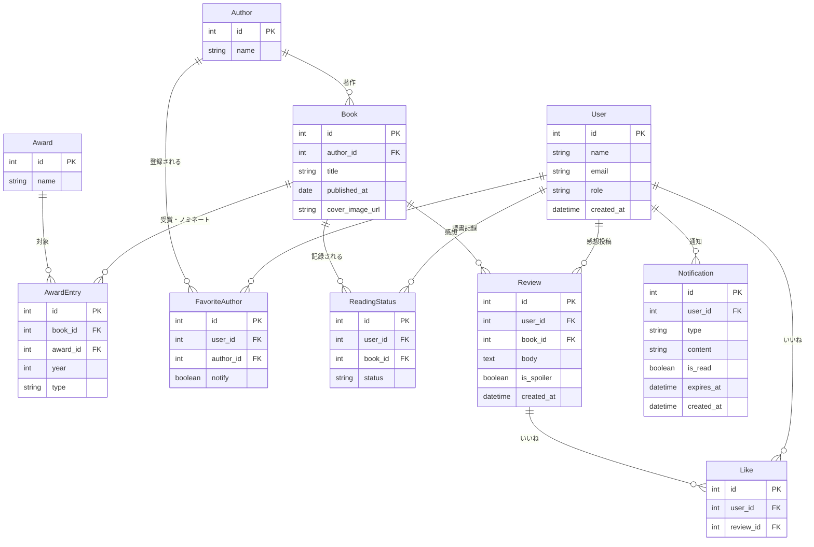

# ER図

## エンティティ説明

| エンティティ | 説明 |
| --- | --- |
| User | アプリ利用者。roleで一般ユーザーと管理者を区別する |
| Author | 著者情報 |
| Book | 書籍情報。楽天ブックスAPIから取得 |
| Award | 文学賞（直木賞・芥川賞・本屋大賞・このミステリーがすごい！） |
| AwardEntry | 書籍と文学賞の受賞・ノミネート関係。typeで受賞/ノミネートを区別する |
| FavoriteAuthor | ユーザーのお気に入り著者登録。notifyで新刊通知ON/OFFを管理する |
| ReadingStatus | ユーザーごとの読書ステータス（読んだ／未読） |
| Review | ユーザーが投稿した感想。is_spoilerでネタバレフラグを管理する |
| Like | 感想へのいいね |
| Notification | アプリ内通知。typeで新刊・いいねを区別する。expires_atで自動削除を管理する |
