# ER図

```mermaid
erDiagram
    User {
        int id PK
        string name
        string email
        string password "nullable（Google OAuth ユーザーは null）"
        string image "nullable"
        datetime emailVerified "nullable"
        string role "user or admin"
        int loginFailCount "ログイン失敗回数"
        datetime lockedUntil "nullable ロック解除時刻"
        datetime createdAt
    }

    Author {
        int id PK
        string name
    }

    Book {
        int id PK
        int authorId FK
        string title
        string isbn "nullable unique"
        string coverImageUrl "nullable"
        date publishedAt
        string source "データ取得元（default: rakuten）"
    }

    Award {
        int id PK
        string name "unique"
    }

    AwardEntry {
        int id PK
        int bookId FK
        int awardId FK
        int year
        string type "winner or nominee"
    }

    FavoriteAuthor {
        int id PK
        int userId FK
        int authorId FK
        boolean notify "新刊通知 ON/OFF"
    }

    ReadingStatus {
        int id PK
        int userId FK
        int bookId FK
        string status "unread / want_to_read / reading / read"
        datetime updatedAt
    }

    Review {
        int id PK
        int userId FK
        int bookId FK
        text body "10〜2000文字"
        boolean isSpoiler
        datetime createdAt
    }

    Like {
        int id PK
        int userId FK
        int reviewId FK
    }

    Report {
        int id PK
        int userId FK
        int reviewId FK
        datetime createdAt
    }

    Notification {
        int id PK
        int userId FK
        string type "new_book or like"
        string content
        string bookIsbn "nullable"
        string bookTitle "nullable"
        boolean isRead
        datetime expiresAt "nullable"
        datetime createdAt
    }

    Account {
        string id PK "cuid"
        int userId FK
        string provider "google など"
        string providerAccountId
        string refresh_token "nullable"
        string access_token "nullable"
        int expires_at "nullable"
        string token_type "nullable"
        string scope "nullable"
        string id_token "nullable"
        string session_state "nullable"
    }

    Session {
        string id PK "cuid"
        int userId FK
        string sessionToken "unique"
        datetime expires
    }

    UserLibrary {
        int id PK
        int userId FK
        string systemid "カーリル図書館システムID"
        string libkey "図書館枝番"
        string name "図書館名"
        string pref "都道府県"
        string city "市区町村 nullable"
        datetime createdAt
    }

    ContactInquiry {
        int id PK
        int userId FK "nullable"
        string name
        string email
        string category
        string subject
        text body
        string status "open / closed（default: open）"
        datetime createdAt
    }

    User ||--o{ UserLibrary : "近隣図書館登録"
    User ||--o{ ContactInquiry : "お問い合わせ"
    User ||--o{ FavoriteAuthor : "お気に入り登録"
    User ||--o{ ReadingStatus : "読書記録"
    User ||--o{ Review : "感想投稿"
    User ||--o{ Like : "いいね"
    User ||--o{ Report : "通報"
    User ||--o{ Notification : "通知"
    User ||--o{ Account : "OAuthアカウント"
    User ||--o{ Session : "セッション"
    Author ||--o{ Book : "著作"
    Author ||--o{ FavoriteAuthor : "登録される"
    Book ||--o{ AwardEntry : "受賞・ノミネート"
    Award ||--o{ AwardEntry : "対象"
    Book ||--o{ ReadingStatus : "記録される"
    Book ||--o{ Review : "感想"
    Review ||--o{ Like : "いいね"
    Review ||--o{ Report : "通報"
```

## エンティティ説明

| エンティティ | 説明 |
| --- | --- |
| User | アプリ利用者。`role` で一般ユーザーと管理者を区別する。`loginFailCount` と `lockedUntil` でアカウントロックを管理する |
| Author | 著者情報 |
| Book | 書籍情報。楽天ブックス API から取得。`isbn` で一意性を保証（ISBN なし書籍は title + authorId で管理） |
| Award | 文学賞（直木賞・芥川賞・本屋大賞・このミステリーがすごい！） |
| AwardEntry | 書籍と文学賞の受賞・ノミネート関係。`type` で `winner`（受賞）/ `nominee`（ノミネート）を区別する |
| FavoriteAuthor | ユーザーのお気に入り著者登録。`notify` で新刊通知 ON/OFF を管理する |
| ReadingStatus | ユーザーごとの読書ステータス（unread / want_to_read / reading / read）。`unread` はレコードなし（デフォルト） |
| Review | ユーザーが投稿した感想（10〜2000 文字）。`isSpoiler` でネタバレフラグを管理する |
| Like | 感想へのいいね。1ユーザーにつき1いいね（`userId_reviewId` で unique） |
| Report | 感想への通報。1ユーザーにつき1通報（`userId_reviewId` で unique） |
| Notification | アプリ内通知。`type` で `new_book`（新刊）/ `like`（いいね）を区別する。`bookIsbn` で通知の重複防止に使用 |
| Account | NextAuth.js の OAuth 連携情報（Google など） |
| Session | NextAuth.js のセッション管理（JWT 戦略のため通常は未使用） |
| UserLibrary | ユーザーが登録した近隣図書館。`systemid` と `libkey` で一意識別。1ユーザー最大 5 件 |
| ContactInquiry | お問い合わせ。未ログインユーザーからの送信も可（`userId` は nullable） |
