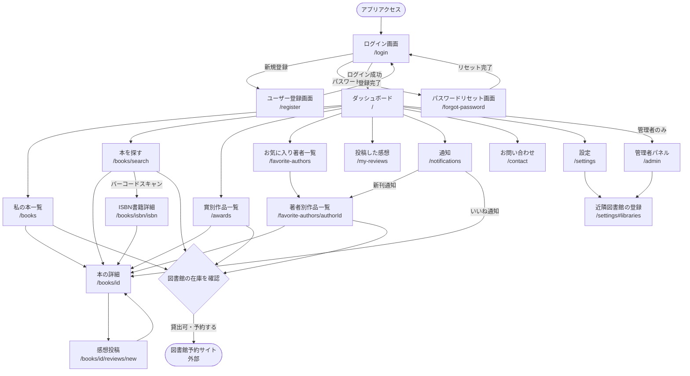

# 画面遷移図

## 画面一覧

### 認証画面

| パス | 画面名 | 認証 |
| --- | --- | --- |
| `/login` | ログイン画面 | 不要 |
| `/register` | ユーザー登録画面 | 不要 |
| `/forgot-password` | パスワードリセット画面 | 不要 |

### メイン画面

| パス | 画面名 | 認証 |
| --- | --- | --- |
| `/` | ダッシュボード | 必要 |
| `/books` | 私の本一覧 | 必要 |
| `/books/search` | 本を探す | 必要 |
| `/books/[id]` | 本の詳細 | 必要 |
| `/books/[id]/reviews/new` | 感想投稿 | 必要 |
| `/books/isbn/[isbn]` | ISBN書籍詳細 | 必要 |
| `/awards` | 賞別作品一覧 | 必要 |
| `/favorite-authors` | お気に入り著者一覧 | 必要 |
| `/favorite-authors/[authorId]` | 著者別作品一覧 | 必要 |
| `/my-reviews` | 投稿した感想 | 必要 |
| `/notifications` | 通知 | 必要 |
| `/contact` | お問い合わせ | 必要 |
| `/settings` | 設定 | 必要 |

### 管理者画面

| パス | 画面名 | 認証 |
| --- | --- | --- |
| `/admin` | 管理者パネル | 必要（admin ロール） |
