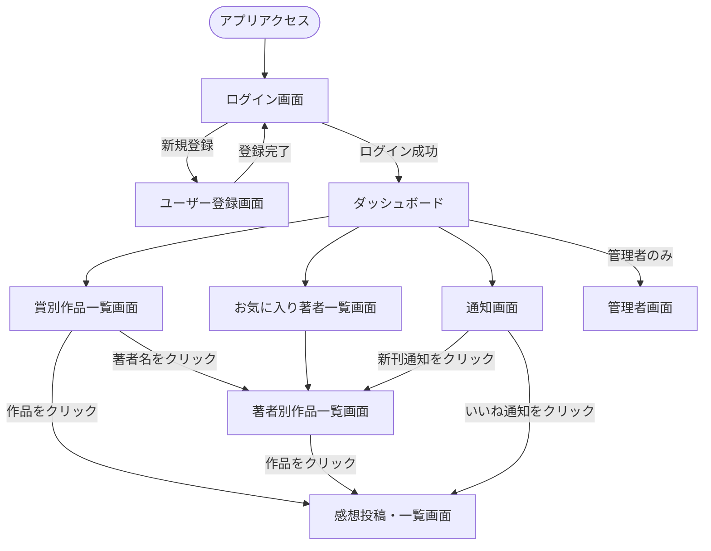

# 画面遷移図

## 画面一覧

| 画面名 | 説明 |
| --- | --- |
| ログイン画面 | 未ログインユーザーの入口 |
| ユーザー登録画面 | 新規アカウント作成 |
| ダッシュボード | ログイン後のトップ画面 |
| 賞別作品一覧画面 | 文学賞ごとの受賞・ノミネート作品一覧 |
| お気に入り著者一覧画面 | 登録済み著者の一覧 |
| 著者別作品一覧画面 | 著者の全作品一覧 |
| 感想投稿・一覧画面 | 本ごとの感想投稿・閲覧 |
| 通知画面 | 新刊・いいね通知の一覧 |
| 管理者画面 | 受賞・ノミネート作品の登録（管理者のみ） |
